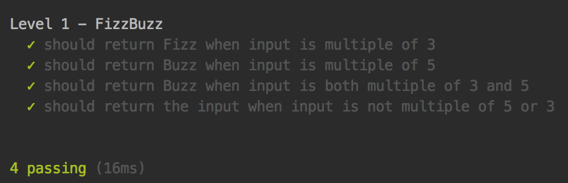

# Cubbit training repository - Level 0

Hi **${name}**, and welcome to the **Cubbit** training repository's **level 0**. Please refer to the repository [main branch](https://github.com/cubbit/interns-training#structure-of-this-repository) to major information about this repositories and about the rules.

## Goals of the level
Main goal of this level will be to [install node.js](https://github.com/cubbit/interns-training#meet-nodejs) and to write a basic hello world application.
To pass the level you will need to:

### Initialization
- [Initialize](https://github.com/cubbit/interns-training#the-node-package-manager-vs-yarn) a brand new NPM repository using npm or yarn.
- Install `mocha` and `chai` as **dev dependencies**
- Add this line `"test": "node_modules/.bin/mocha test/index.js"` to the `"scripts"` section of your `package.json` file
- Create a `src` folder under root.
- Create a new `index.js` file inside `src`
- Launch `npm test` in your terminal: the 2 tests **must fail**.

### Hello world
Write a basic javascript object to expose a function `say`. The signature of the function must be

`function say(name)`

and must return alternatively:

- the string `"Hello world!"` if nothing is passed as parameter
- the string `"Hello ${name}"` if a name is passed as a parameter

Try out your brand new application launching again `npm test`. When both the tests will pass correctly please make a pull request to get your code reviewed.

For more info about pull request please refer to [this guide](https://help.github.com/articles/about-pull-requests/).

## Info and help
For info about this repository please write on the #help channel on slack or to:

- [marco.moschettini@cubbit.net](mailto:marco.moschettini@cubbit.net)
- [alessio.paccoia@cubbit.net](alessio.paccoia@cubbit.net)
